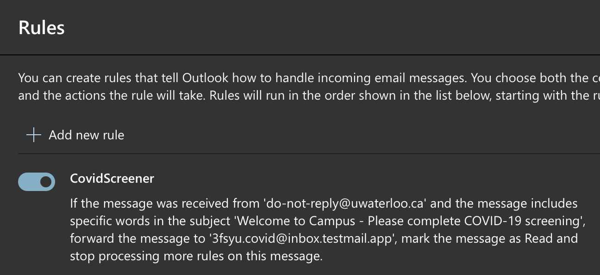

# Automatic Covid Screener
*Allows uwaterloo students to automatically complete their covid screening by forwarding the email with subject containing "Welcome to Campus - Please complete COVID-19 screening" to `3fsyu.covid@inbox.testmail.app`*

***By using this you agree you have said no to all of the screening questions, but are just annoyed at clicking through it every single day***

Simply forward the email, which can be done automatically in outlook like this:

